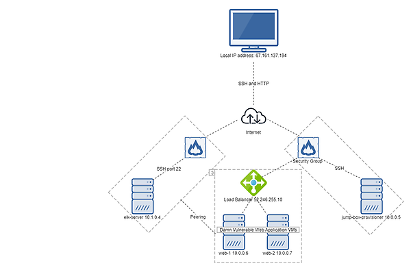
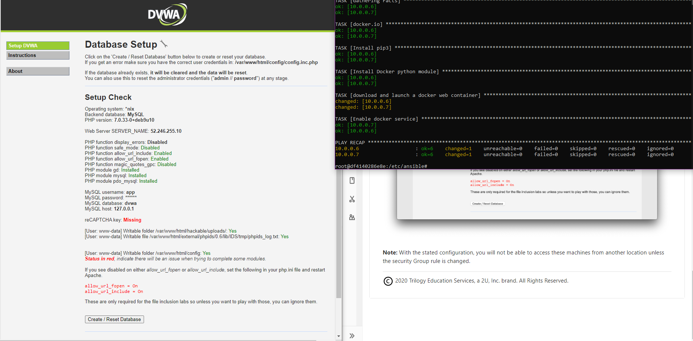
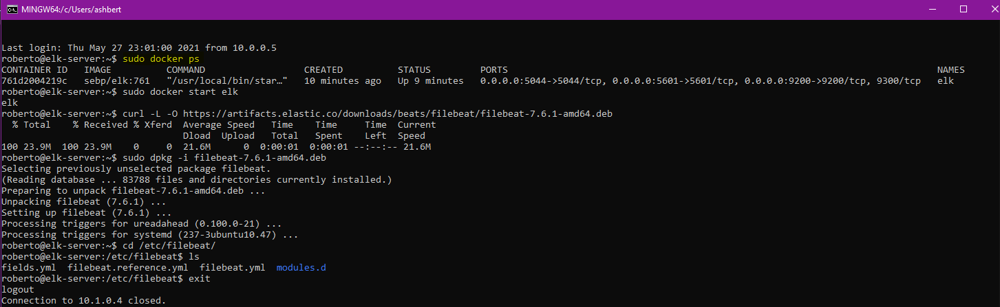
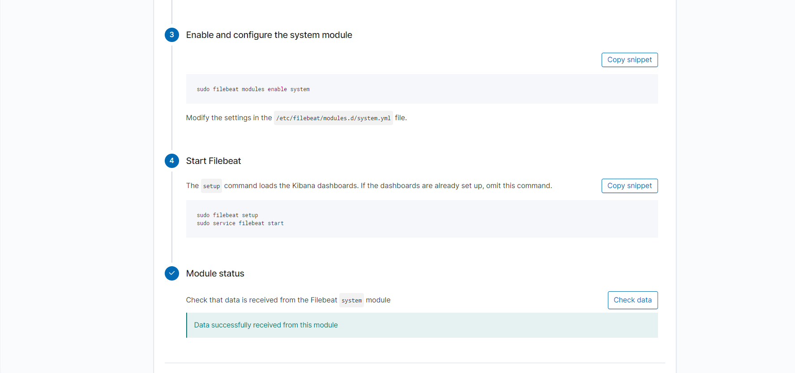
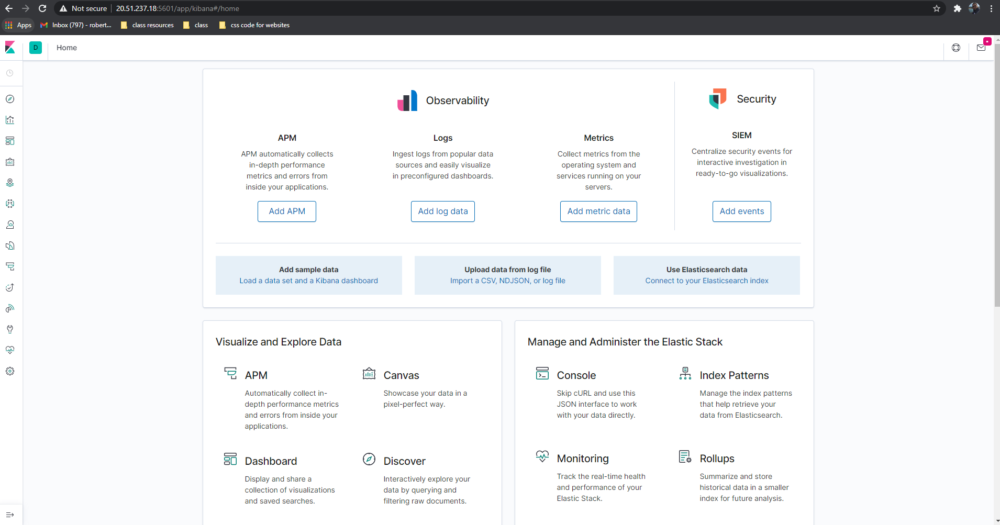
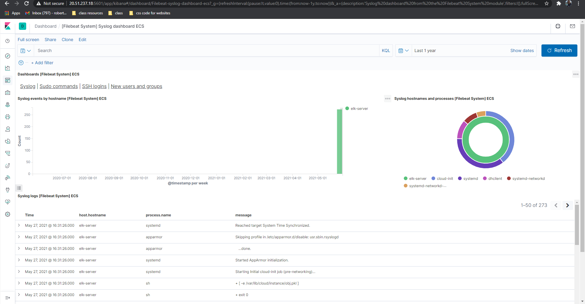
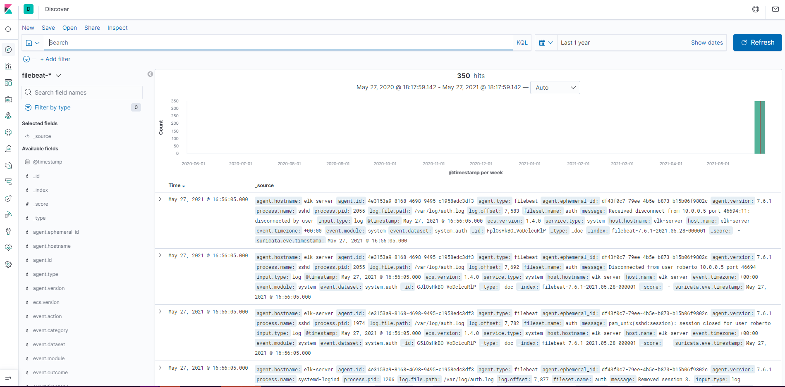
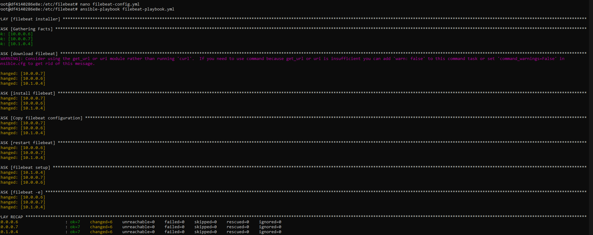

# Elk-Stack-Project

The files that are provided in this repo were used to configure the network that is shown in the image below.

All of the files were tested and utilized in order to create a live ELK deployment on Azure and by doing so, they can recreate the network above. Filebeat was installed and used as a portion of the playbook file. The configuration of the filebeat playbook was also part of the process.

#insert filebeat-playbook.yml
#insert filebeat-playbook-config.yml

The following will be described:
- Topology Description
- Access Policies
- ELK Configuration
  - Beats Used
  - Monitored Machines
- Using Ansible

# Topology Description
The goal of this network was to expose the a load-balanced Damn Vulnerable Web Application (DVWA) and have the exposed DVWA instances be monitored as well. 

Using a load-balancer ensures that the application would be available for an "attack" but also ensures that outside ip addresses can't gain access. The load-balancer is able to do this because they protect the servers by distributing traffic amongst the servers that are available. In combination, the load-balancer and jump box together enables a layer of protection for the virtual machines (VMs) from public exposure. Below shows a successful load-balancer setup with Ansible.

Adding an ELK server into the combination enables a monitoring system for the VMs to visualize any changes that might occur to the log files and system performance, making it a better method of discovering an "attack" by analyzing any changes in these logs. This is where Filebeat comes into play as the monitoring system.

Below is a list of the machines in the network that were configured and used as well as the applications used.
| Name                 | Function         | IP Adddress | Operating System |        
|----------------------|------------------|-------------|------------------|      
| jump-box-provisioner | Gateway          | 10.0.0.5    | Linux            |
| web-1                | Container VM     | 10.0.0.6    | Linux            |
| web-2                | Container VM     | 10.0.0.7    | Linux            |
| elk-server           | Kibana Container | 10.1.0.4    | Linux            |

| Name       |
|------------|
| Docker     |
| Filebeat   |
| Metricbeat |
| Ansible    |

# Access Policies
The machines that were used were not accessible to the public (due to the usage of a load-balancer).

The jump-box-provisioner was the only machine that had access to the internet, but even then the machine did not permit outside access and only permitted access from the local ip address (my ip address). Below shows the access policies that each machine had.

| Name                 | Public Access Allowed | Allowed IP Address(es)   |
|----------------------|-----------------------|--------------------------|
| jump-box-provisioner | No                    | Local machine ip address |
| web-1                | No                    | 10.1.0.4                 |
| web-2                | No                    | 10.1.0.4                 |
| elk-server           | No                    | 10.1.0.4                 |

# ELK Configuration
Configuring the ELK machine was a simple task as the process was automated with ansible. Using ansible allows for a quicker setup due to the lack of necessity for other software installations. Plus, ansible can be run from the command line. The playbook from ansible does the following tasks:
-Create the playbook to install a container with docker, filebeat, and metricbeat
-Configure said container
-Run said playbook to launch the docker elk

Once the above configuration was completed, docker ps was run to show a successful ELK configuration.

# Beats Used and Machines Monitored
The ELK server was used to monitor the VMs: web-1 and web-2. Filebeat and metricbeat were the two beats used to aid in monitoring the machines. By using filebeat, the user is able to determine any unusual activity that may be occurring on the machines by viewing the logged information on the Kibana servers. Below is an overview of Kibana.

This image shows that the ELk has a connection with filebeat, and therefore has sent the system's logged data over to the Kibana servers.

This image shows the landing page of Kibana. The user can browse through multiple options in order to analyze the metrics that the system has logged.

This image shows the data that was logged from filebeat, showing the timestamp of the logged activity and the count. There is also a message per activity to show the user what type of activity is occuring.

This image shows more detail on each logged activity.

# Using Ansible
A configured Ansible control node was used for the playbook. The filebeat config file was copied to the ELK VM and the "hosts" file was updated to include the web-1 and web-2 ip addresses. Looking on Kibana was the way to confirm that running the playbook installation worked. But the image below also shows a successful installation.

